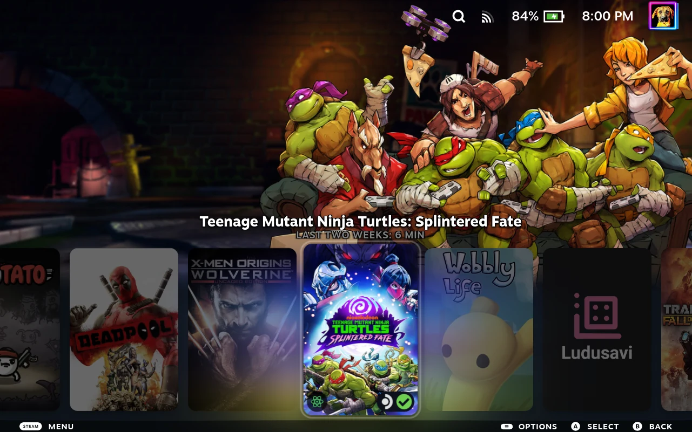
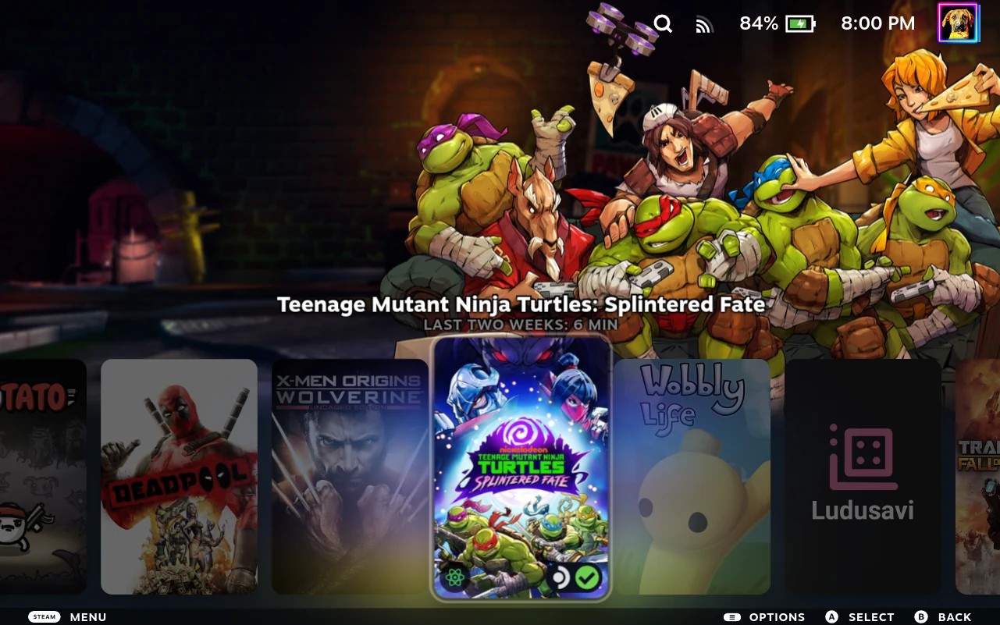
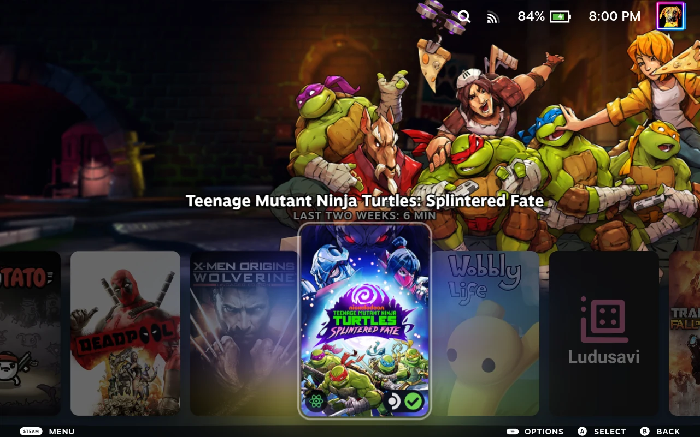
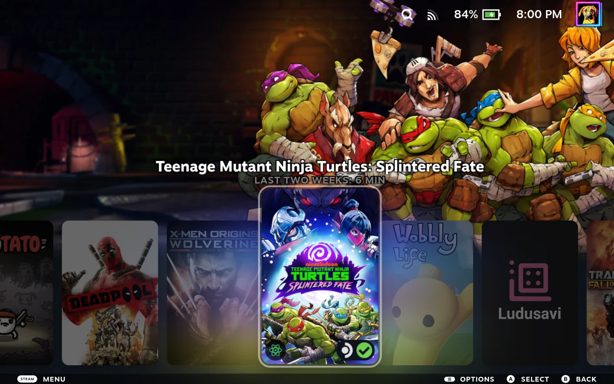
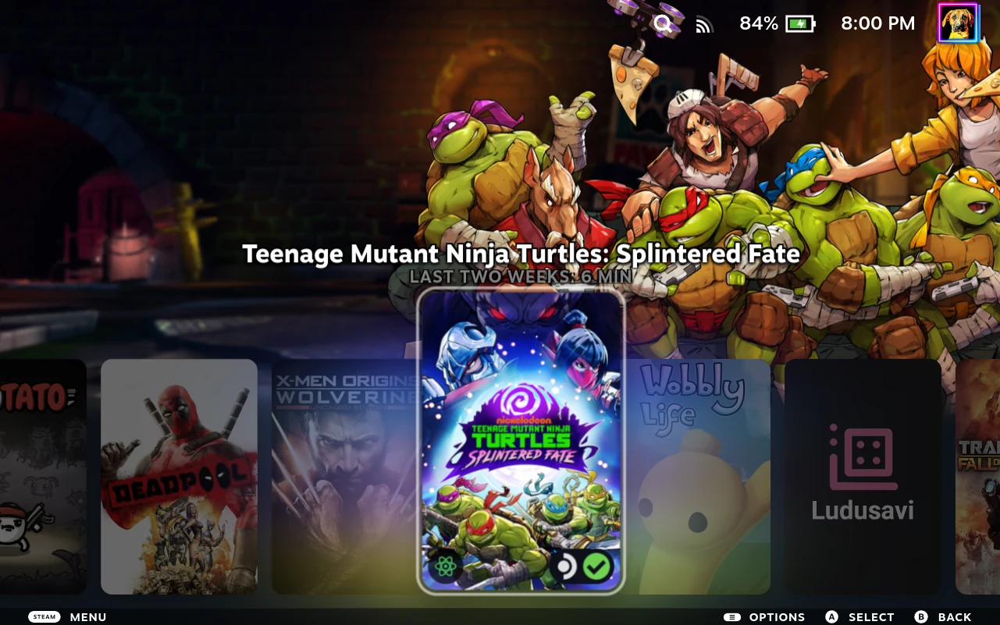
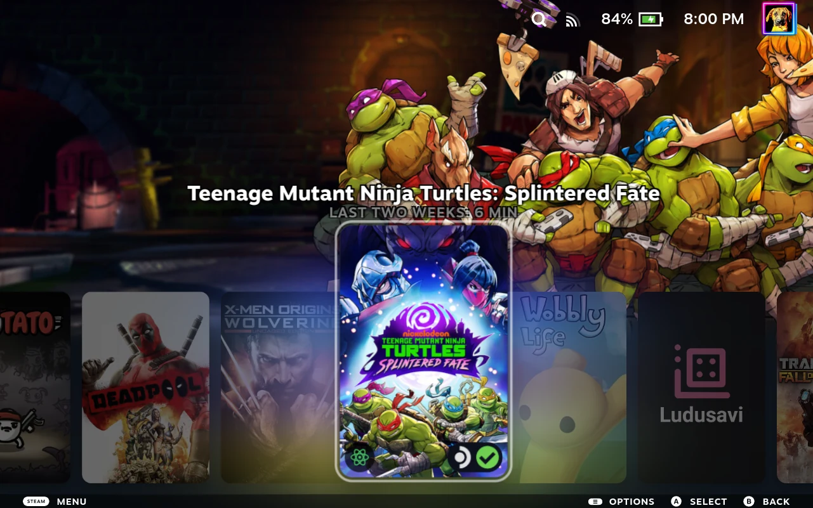
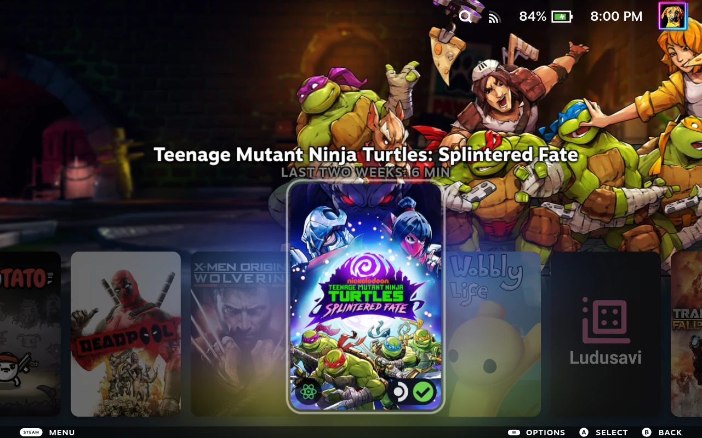

# Home Carousel Zoom

A [CSS Loader](https://docs.deckthemes.com/CSSLoader/) theme for SteamOS Gaming Mode. Enlarge a Home carousel cover when you hover over it with a pointer or select it with a controller.

**Two sliders set the size: Base zoom (%) from 100 to 200 in steps of 10, and Fine adjustment from +0 to +10 in steps of 1. The two values are added, which gives 100% to 210% total. Default: 110 + 5 = 115%.**

The focus ring and attached title move with the cover. The Library grid is not changed, and the **View more in your Library** card at the end of the row keeps its normal size. Selecting that card no longer makes the Home page jump vertically; normal horizontal scrolling remains.

## Screenshots

The screenshots use **Art Hero**, **Centered Game Text**, **Game Header Text Stroke**, **Darken Unfocused Games**, and **Round**, with other installed plugins supplying badges. Those appearance changes are not part of Home Carousel Zoom and are not required or bundled.

Percentages apply to the selected card's existing appearance. **100% keeps Steam's normal focus effect**; it does not remove that effect. These screenshots cover 100% to 130%; the sliders now reach 210%.

| Total zoom | Slider values | Steam Deck screenshot |
| --- | --- | --- |
| 100% | 100 + 0 |  |
| 105% | 100 + 5 |  |
| 110% | 110 + 0 |  |
| **115% — default** | **110 + 5** |  |
| 120% | 120 + 0 |  |
| 125% | 120 + 5 |  |
| 130% | 130 + 0 |  |

## Install

You need [Decky Loader](https://decky.xyz/) and its CSS Loader plugin.

The two sliders, artwork glow, and custom focus controls require **v1.1.0 or later**. If the latest release is older, use the repository installation below.

### From a release

1. Download the theme ZIP from [Releases](https://github.com/beallio/CSSLoader-Home-Carousel-Zoom/releases).
2. In Desktop Mode, create `~/homebrew/themes/Home Carousel Zoom/`.
3. Extract all files into that folder, without another nested folder. For v1.1.0, it must contain `theme.json`, `shared.css`, `focus.css`, `artwork.css`, and `LICENSE`.
4. Return to Gaming Mode. Open **… → Decky → CSS Loader**, then select **Refresh**.
5. Enable **Home Carousel Zoom**.

### From this repository

Copy the complete [`Home Carousel Zoom`](Home%20Carousel%20Zoom) folder into `~/homebrew/themes/`, then refresh CSS Loader and enable the theme. Do not copy the repository root into the themes folder.

## Adjust the size

Open **… → Decky → CSS Loader → Home Carousel Zoom** and expand the theme's settings. There are two sliders:

| Slider | Range | Step | Default |
| --- | --- | --- | --- |
| **Base zoom (%)** | 100 to 200 | 10 | 110 |
| **Fine adjustment** | +0 to +10 | 1 | +5 |

**Total zoom = Base zoom + Fine adjustment.** For example, `110 + 5` gives 115%, `130 + 7` gives 137%, and `200 + 10` gives 210%.

- Use left/right controller input on each slider to decrease/increase its value.
- Different combinations can give the same total. `100 + 10` and `110 + 0` both give 110%.
- Pointer hover and controller focus both trigger zoom. A touchscreen has no persistent hover state.
- Covers grow over adjacent cards rather than pushing them apart. Large values can cover neighboring cards, titles, or the status bar. On the stock Steam layout, high zoom can extend above the screen and cut off the cover. Lower the zoom if the cover does not fit.
- If you used the earlier single **Zoom size** slider, your saved value does not transfer. The theme starts at the 115% default, so set the two sliders again after the update.

## Adjust the highlight and glow

**Focus appearance** selects who controls the Home cover's outline:

- **Steam default** (default) leaves Steam's outline in place. Other enabled themes can still change its appearance; this option does not disable them.
- **Custom** adds a fixed-color outline and an optional halo, and hides the cover's animated sheen. It does not remove the artwork-colored glow.

The two glows are separate. **Artwork glow** is the broad, translucent effect that takes its colors from the cover art. **Halo strength** controls the added glow around the custom outline.

| Setting | Works in | Options | Default |
| --- | --- | --- | --- |
| **Artwork glow (Both modes)** | Steam default and Custom | Normal / Off / Low / Medium / High | Normal |
| **Highlight color** | Custom only | Open the color picker; adjust hue, saturation, lightness, and alpha, then select **Confirm** | White at 60% alpha (`#ffffff99`) |
| **Outline thickness (Custom only)** | Custom only | Thin / Medium / Thick | Medium (2 px) |
| **Halo strength (Custom only)** | Custom only | Off / Low / Medium / High | Off |

- **Artwork glow → Normal** leaves Steam's and your other themes' artwork effect unchanged. **Off** hides it. Low, Medium, and High set its opacity to 25%, 50%, and 100%; they do not change its colors.
- **Halo strength → Off** removes only the custom halo. It keeps the custom outline and does not change Artwork glow.
- Color-picker alpha controls the opacity of the custom outline and halo, not Artwork glow. Alpha zero makes the custom outline and halo invisible.
- CSS Loader shows the color picker only in Custom mode. Its current theme format cannot hide or disable the separate outline and halo dropdowns in Steam default mode. They are labeled **Custom only** and have no effect in Steam default mode.
- Switching back to **Steam default** removes the custom outline and halo without discarding your custom settings. Artwork glow keeps its separate setting. CSS Loader saves all settings across refreshes.
- These effects follow pointer hover and controller focus, scale with the cover, and leave the Library shortcut and Library grid unchanged.
- If you installed the earlier development build with **Outline thickness** and **Glow strength**, set their values again under the new **Custom only** names. Saved profiles that use the old names must also be saved again.
- **Existing appearance** was renamed **Steam default**. Re-save profiles that refer to the old option name. Updated Custom defaults do not overwrite saved color, thickness, or halo choices.

### Why the glow differs between games

Steam creates the broad artwork glow from a copy of the selected cover. Its current filter multiplies saturation by three and brightness by two, then applies a 3 px blur. Bright colors and large bright areas in the cover therefore produce different glow colors and brightness, even at the same Artwork glow strength.

The custom halo has a fixed color, but its background changes how visible it is. For example, a white halo blends into Deadpool's white background more than it does into the colored backgrounds of Wobbly Life or Transformers Fall of Cybertron. A stronger-looking glow does not necessarily mean a stronger setting.

For a single-color effect, set **Artwork glow → Off** and choose a Custom halo strength. This removes the artwork-dependent glow, but background contrast still affects the halo's appearance.

### Defaults and manual reset

The Custom starting values use Steam's current base outline color and width: white at 60% alpha, 2 px thick, with no added custom halo. These values do not recreate Steam's animated outline, outline offset, shadow, or artwork effect. For the native focus effects, select **Focus appearance → Steam default** and **Artwork glow → Normal**; other enabled themes remain in effect.

The installed CSS Loader has no button to reset this group of settings, and its theme format cannot add one. To reset Custom manually:

1. Select **Custom** and open **Highlight color**.
2. Set Hue to **0**, Saturation to **0**, Lightness to **100**, and Alpha to **0.6**, then select **Confirm**.
3. Set **Outline thickness → Medium** and **Halo strength → Off**.
4. Set **Artwork glow → Normal** if you also want to restore the existing artwork effect.

These steps leave both zoom sliders unchanged.

## License and credits

The theme code is licensed under the [MIT License](LICENSE).

Steam and its interface belong to Valve. Game artwork, names, and logos visible in the screenshots belong to their respective owners; the MIT license does not grant rights to that artwork. The selected game in the comparison is *Teenage Mutant Ninja Turtles: Splintered Fate*. Screenshots document this theme's behavior, not ownership of the depicted artwork.

Art Hero is by Metagawa. Centered Game Text is by SuchMeme. These and the other appearance themes shown in the screenshots are separate projects, not included in this theme. CSS Loader and Decky Loader are separate projects; this theme is not an official Valve product.
