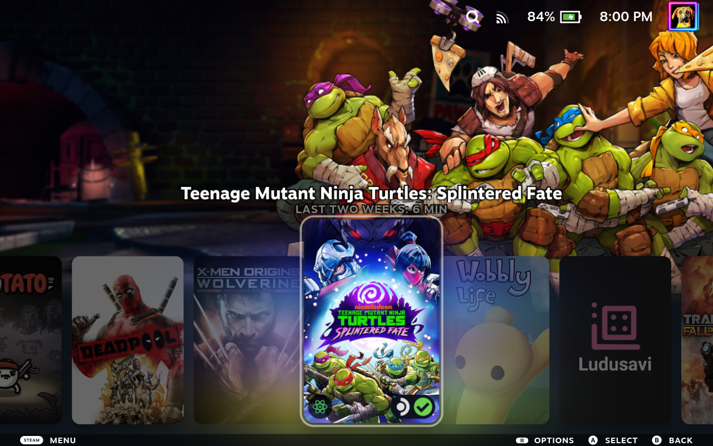

# Home Carousel Zoom

Home Carousel Zoom is a theme for [CSS Loader](https://docs.deckthemes.com/CSSLoader/) on the Steam Deck. When you select or point to a game on your home screen carousel, this theme enlarges that cover so it stands out.

Your Library grid stays untouched, and the "View more in your Library" card keeps its standard size.

[**Download Home Carousel Zoom v1.1.0 (.zip)**](https://github.com/beallio/CSSLoader-Home-Carousel-Zoom/releases/download/v1.1.0/Home-Carousel-Zoom-v1.1.0.zip)

*Note: The preview shows **Custom** styling in cyan at 115% zoom, not the default appearance. Only this theme was active in CSS Loader; badges shown on the cover are from separate Decky plugins and are not included.*

## Installation

You need [Decky Loader](https://decky.xyz/) and the **CSS Loader** plugin installed.

1. Switch your Steam Deck to **Desktop Mode**.
2. Download the [v1.1.0 ZIP file](https://github.com/beallio/CSSLoader-Home-Carousel-Zoom/releases/download/v1.1.0/Home-Carousel-Zoom-v1.1.0.zip).
3. Open your file manager, browse to `~/homebrew/themes/`, and create a new folder named `Home Carousel Zoom`.
4. Extract the ZIP directly into `~/homebrew/themes/Home Carousel Zoom/`. Verify these five files sit directly inside that folder: `theme.json`, `shared.css`, `focus.css`, `artwork.css`, and `LICENSE`.
5. Return to **Gaming Mode**. Press the **…** (Quick Access) button, open **Decky → CSS Loader**, and select **Refresh**.
6. Toggle **Home Carousel Zoom** to **On**.

## Adjusting Cover Size

Press **… → Decky → CSS Loader → Home Carousel Zoom** to adjust your settings.

Two sliders work together to set the total size:
- **Base zoom (%)**: Adjusts size in larger steps from 100 to 200 (Default: 110).
- **Fine adjustment**: Fine-tunes size in small changes from +0 to +10 (Default: +5).

**Total zoom = Base zoom + Fine adjustment.**
The default settings (`110 + 5`) provide 115% zoom. Setting `100 + 0` keeps Steam's standard size, while `200 + 10` gives the maximum 210% zoom.

## Adjusting the Highlight and Glow

Two separate glow effects exist:
1. **Artwork glow**: The colorful backlighting Steam pulls from game cover art.
2. **Custom halo**: An extra colored ring you can add around the cover.

### Focus Outline & Halo
- **Focus appearance**:
  - **Steam default**: Uses Steam's standard focus outline without affecting your other CSS Loader themes.
  - **Custom**: Activates your chosen outline color and an optional halo glow.
- **Highlight color**: Sets the color for the custom outline and halo. The alpha slider controls transparency on a scale of 0 to 1 (0 completely hides the color, 1 is fully solid).
- **Outline thickness (px, Custom only)**: Sets border width from 1 to 10 px (Default: 2 px).
- **Halo size (px, Custom only)**: Controls the soft glow around the cover, from 0 to 30 px (Default: 0 px). Setting this to 0 turns off the halo.

### Artwork Glow
- **Use Steam's artwork glow**: Set to **On** to keep Steam's normal cover lighting. Set to **Off** to unlock:
  - **Artwork opacity (%, override only)**: Adjusts the cover lighting from 0% (completely off) to 100% (Default: 50%).

## Resetting Settings

- Turning **OFF** Home Carousel Zoom in CSS Loader removes all of this theme's changes.
- To keep the zoom effect while using standard focus visuals, set **Focus appearance** to **Steam default** and **Use Steam's artwork glow** to **On**.

## Troubleshooting

- **Top of the cover is clipped:** Covers expand outward over neighboring elements. At very high zoom levels, a cover can stretch past the screen edge. Lower your zoom sliders until it fits comfortably.
- **Sliders have no effect:** Settings marked **Custom only** only work when **Focus appearance** is set to **Custom**. Settings marked **override only** only work when **Use Steam's artwork glow** is turned **Off**.

## Credits and License

The theme code is licensed under the [MIT License](LICENSE).

This is an independent community project and is not an official Valve product. Steam and the Steam Deck are trademarks of Valve Corporation. Game titles, logos, and cover art belong to their respective copyright holders.
